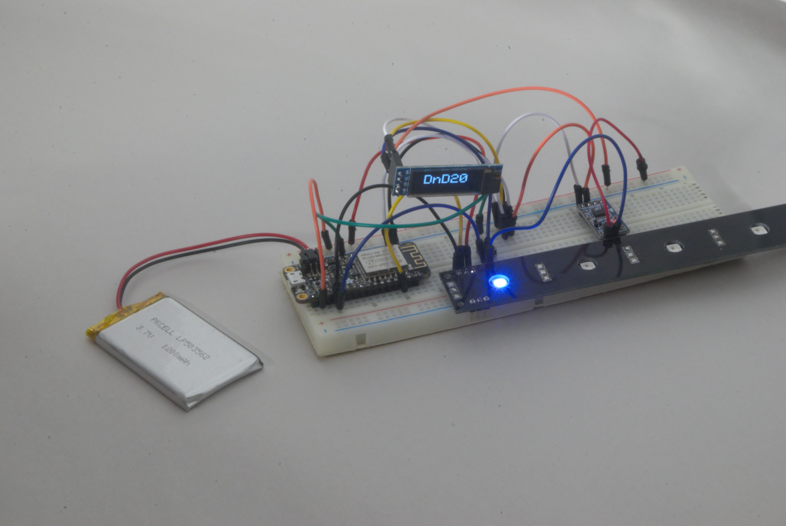
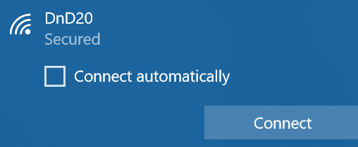
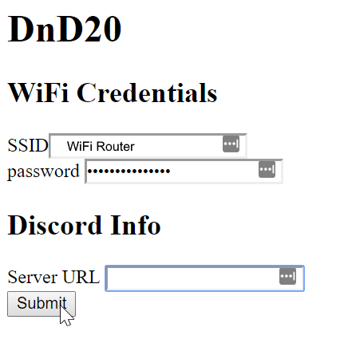
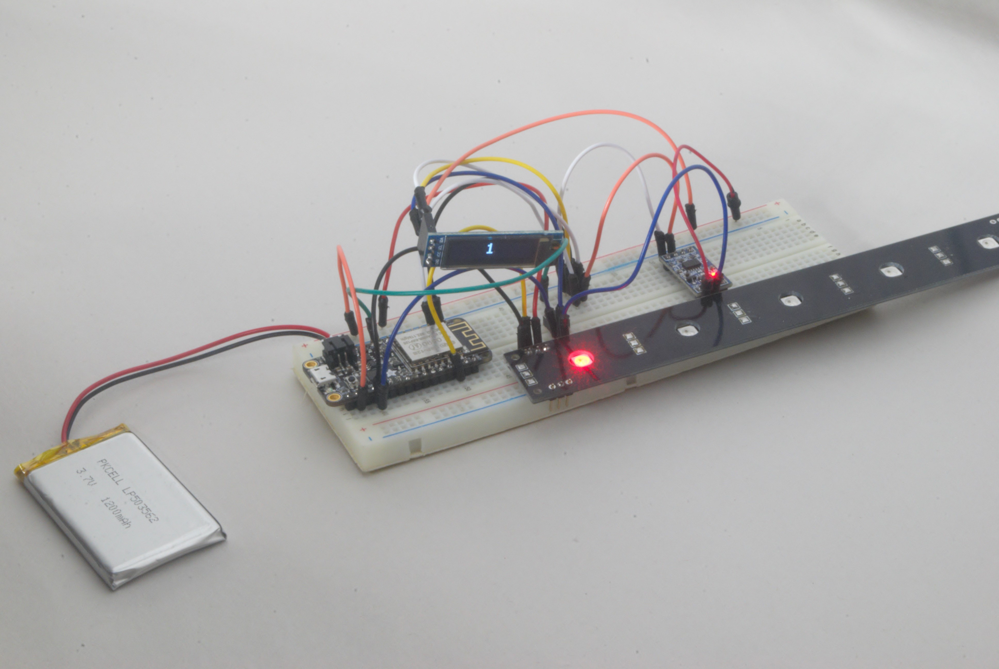

# Benchtop Prototype
** Rolling a Nat 20 **

### 1. Connect to WiFi

When DnD20 first starts, the LED will be purple (it looks more purple IRL). This means that you are ready to enter in your WiFi credentials to get it logged on. 

* the password is prestidigitation *

Alternatively, you can skip this step and start rolling without internet connection by pressing and holding the button.

In the future you'll be able to enter in your Discord server URL and a name for the bot, but for now you have to hardcode it in.

### 2. Start Rolling

You can now start rolling a D20. Right now, rolling is simply tilting the device far enough toward the positive x direction for a moment. 

A Critical Failure turns the LED **red** in shame. A natural 20 turns the LED **gold** in triumph.

After rolling, there is a 10-second timeout so you can look at the device without re-rolling. To skip this, press the button momentarily.

If everything goes well with the WiFi setup and Discord webhook, and everything in-between, then your rolls should start showing up on your Discord server!

### 3. Change the Die

While in the main rolling mode, you can change over to *Programming Mode* by pressing and holding the button.

In this mode, the LED turns green, and you can change the sidedness of the dice. So you can get anything from a d2 to a d20.

# What's Next?
Now that I've got everything working, at least when I'm lucky, it's time for improvements and upgrades.

### Code
The code is a mess. It is cobbled together. Re-organizing will help readability. I will also considering moving chunks to their own files.

The other most important thing is to get stability to the code. The ESP8266 still restarts occasionally, and has trouble advancing into the "normal mode". This has something to do with giving CPU time over to the WiFi duties by calling yield(). There may also be some strange conflicts in the libraries I'm using, since some of them are shared by multiple classes.

### Mechanical
I want to design the shell for this device. It will obviously be a d20. I'm imagining it in 2 halves. Where they come together will be a spot for the PCB. The button and power switch don't necessarily need to come off of the PCB itself, but can be attached with wires and be screwed into the side of the shell.

One thing I'm curious about is the placement of the accelerometer. It can either go near the middle or near the outside. Near the outside seems like it would hit the highest peak forces. The highest-acceleration would be from gravity and centripetal acceleration as the device rolls.

Placing the accelerometer in the center means that centripetal force is negligible. So all of the forces are from gravity only, and we'll just see the force vector moving around at a more constant magnitude. This might simplify the analysis it takes to determine a legitimate roll.

One more thing on the mechanical side. I was thinking the PCB might be put on rubber standoffs. I imagine a rubber net of sorts. The advantage to this is it acts like a low-pass filter. The device is going to be thrown on a table which will generate sharp peaks of force that could be a problem.

### Electronics
The next step here is to design a PCB. I mean, I could solder it up, but PCBs are so much nicer and more fun. The schematic can be done right away. The most uncertain part for me is the accelerometer board. The ESP8266 is an Adafruit Huzzah Feather board, so I can use their schematic to figure stuff out. The LED is a WS2812, which only needs a capacitor and maybe a resistor. As for the OLED, I'll probably just stick with the current screen.

I'm going to use this project as an opportunity to use the FreeCAD Stepup plugin to generate a board layer from an mCAD file.

### Functionality
**Programming Mode**
* I want to combine the WiFi setup with the program mode, it makes more sense to have a single programming mode
* Then, I want to have the Web App always hosted in programming mode. It will be accessible through the hosted Access Point if the WiFi isn't setup, or through the local network if it is connected
* The Web App will have more features, like being able to set the sidedness of the die, changing the Bot name, and the Discord server

**Magic 8-Ball**
* This thing is just asking to become a magic 8 ball, so I'll oblige
* Will be selectable through the web-app, or through some sort of button press, maybe holding for longer

**Button & LED**
* Right now you have to count in your head, then add some, to make sure you've held the button down long enough
* Instead, the LED should change colors once you've held the button down long enough, so you know you can let go. This also enables the use of holding down for long periods to cycle through several different options